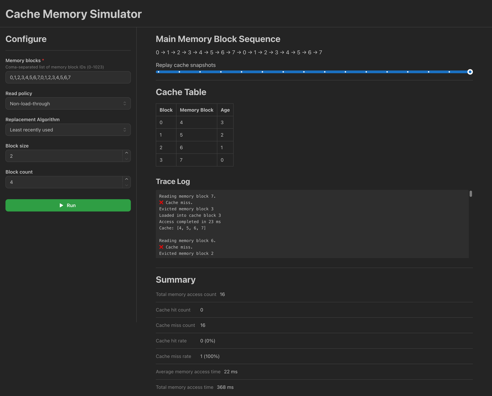
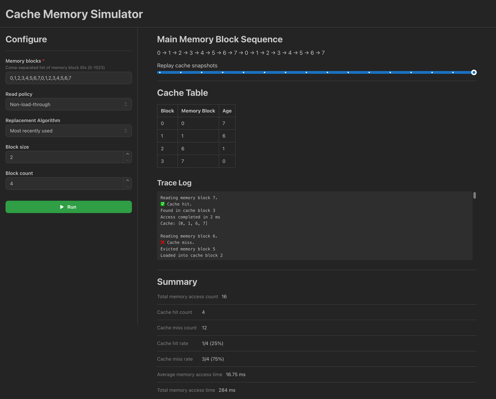
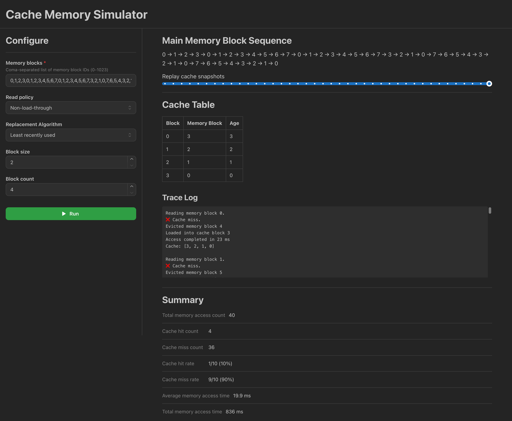
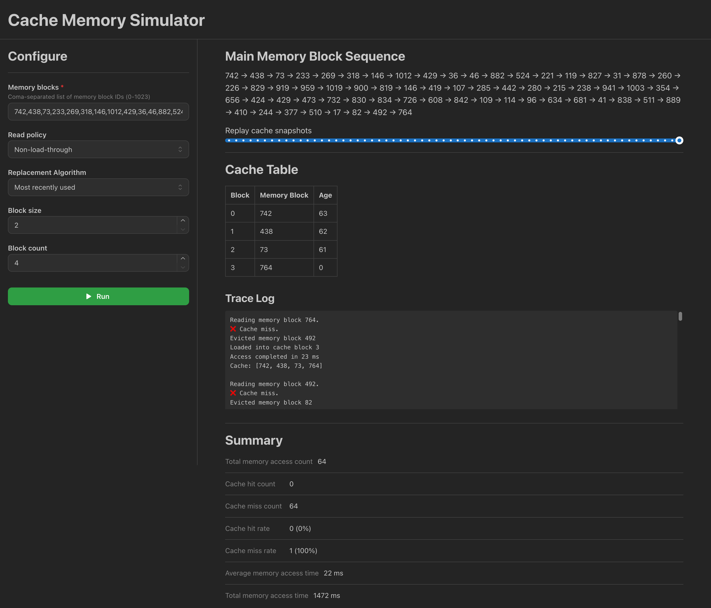

# Cache Memory Machine (Machine 6)

An interactive web simulator for cache using fully associative mapping and least or most recently used replacement
algorithms.

## System Specifications and System Parameters

The cache memory simulator models Machine 6 specifications, evaluating Fully Associative (FA) mapping under Least
Recently Used (LRU) and Most Recently Used (MRU) replacement algorithms.

- **Main Memory Size:** 1024 blocks (fixed address range from 0 to 1023).
- **Cache Architecture:** Fully Associative (FA) mapping, allowing any main memory block to occupy any cache line.
- **Cache Block Count ($n$):** 4 blocks.
- **Block Size:** 2 words per block.
- **Read Policy:** Non-load-through.
- **Replacement Algorithms Evaluated:**
  - **Least Recently Used (LRU):** Evicts the cache block that has remained unaccessed for the longest duration.
  - **Most Recently Used (MRU):** Evicts the cache block that was most recently accessed.

## Video Walkthrough

## Test Cases

### Simulator Configuration

|             | Least recently used | Most recently used |
| :---------- | :-----------------: | :----------------: |
| Read policy |  Non-load-through   |  Non-load-through  |
| Block size  |          2          |         2          |
| Block count |          4          |         4          |

### a. Sequential Sequence

- **Input Pattern:** Access up to $2n$ cache blocks sequentially and repeat the sequence twice.
- **Sequence ($n = 4$):** `0,1,2,3,4,5,6,7,0,1,2,3,4,5,6,7` (16 total accesses).

  
  

| Metric                         | Least Recently Used | Most Recently Used |
| :----------------------------- | :-----------------: | :----------------: |
| **Total Memory Accesses**      |         16          |         16         |
| **Cache Hit Count**            |          0          |         4          |
| **Cache Miss Count**           |         16          |         12         |
| **Cache Hit Rate**             |         0%          |        25%         |
| **Cache Miss Rate**            |        100%         |        75%         |
| **Average Memory Access Time** |        22 ms        |      16.75 ms      |
| **Total Memory Access Time**   |       368 ms        |       268 ms       |

- **LRU Performance Analysis:**
  - Accesses `0`, `1`, `2`, `3` result in misses, populating lines 0 through 3.
  - Accesses `4`, `5`, `6`, `7` cause continuous evictions. Since LRU evicts the oldest line, block `4` replaces `0`,
    `5` replaces `1`, `6` replaces `2`, and `7` replaces `3`.
  - When the sequence repeats (`0` through `7`), block `0` was evicted immediately prior, causing 100% continuous
    misses.
  - **Result:** 0 hits, 16 misses (0% hit rate).

- **MRU Performance Analysis:**
  - Accesses `0`, `1`, `2`, `3` result in misses, populating lines 0 through 3.
  - When accessing block `4`, MRU evicts block `3`. Accesses `5`, `6`, `7` repeatedly replace that single line,
    preserving blocks `0`, `1`, `2` in cache.
  - On the second iteration, accesses to `0`, `1`, `2` and `7` hit in cache.
  - **Result:** 4 hits, 12 misses (25% hit rate). MRU outperforms LRU on cyclic sequences exceeding capacity by
    preserving earlier working set elements.

### b. Mid-Repeat Blocks

- **Input Pattern:** Access blocks `0` to $n-1$, repeat sequence up to $2n-1$ twice, then execute reverse pattern.
- **Sequence ($n = 4$):** `0,1,2,3,0,1,2,3,4,5,6,7,0,1,2,3,4,5,6,7,3,2,1,0,7,6,5,4,3,2,1,0,7,6,5,4,3,2,1,0` (40 total
  accesses).

  
  

| Metric                         | Least Recently Used | Most Recently Used |
| :----------------------------- | :-----------------: | :----------------: |
| **Total Memory Accesses**      |         40          |         40         |
| **Cache Hit Count**            |          4          |         17         |
| **Cache Miss Count**           |         36          |         23         |
| **Cache Hit Rate**             |         10%         |       42.5%        |
| **Cache Miss Rate**            |         90%         |       57.5%        |
| **Average Memory Access Time** |       19.9 ms       |     13.075 ms      |
| **Total Memory Access Time**   |       836 ms        |       563 ms       |

- **LRU Performance Analysis:**
  - LRU achieves high hit rates during short loops within capacity (repeating `0`, `1`, `2`, `3`).
  - During larger sequential sweeps (`0` through `7`), LRU thrashes continuously.
  - Upon reversing sequence directions, LRU captures localized hits at turning points.
  - **Result:** 4 hits, 36 misses (10% hit rate).

- **MRU Performance Analysis:**
  - MRU incurs misses on short localized loops due to top-slot replacement.
  - During longer sequential sweeps, MRU protects baseline anchor blocks (`0`, `1`, `2`), capturing repeated hits when
    loops return to initial elements.
  - **Result:** 17 hits, 23 misses (42.5% hit rate)

### c. Random Sequence

- **Input Pattern:** 64 randomly generated block access requests within range 0 to 1023.

  
  

| Metric                         | Least Recently Used | Most Recently Used |
| :----------------------------- | :-----------------: | :----------------: |
| **Total Memory Accesses**      |         64          |         64         |
| **Cache Hit Count**            |          0          |         0          |
| **Cache Miss Count**           |         64          |         64         |
| **Cache Hit Rate**             |         0%          |         0%         |
| **Cache Miss Rate**            |        100%         |        100%        |
| **Average Memory Access Time** |        22 ms        |       22 ms        |
| **Total Memory Access Time**   |       1472 ms       |      1472 ms       |

- **Comparative Performance Analysis:**
  - Due to the large main memory space (1024 blocks) relative to small cache capacity (4 blocks), uniform random access
    yields negligible temporal locality.
  - **Result:** Both algorithms result in 0 hits and 64 misses (0% hit rate).

## Replacement Algorithm Comparison Summary

| Metric / Scenario       | Fully Associative + LRU                 | Fully Associative + MRU                    |
| :---------------------- | :-------------------------------------- | :----------------------------------------- |
| **Cyclic Loops**        | Complete Thrashing (0% Hit Rate)        | Retains $n-1$ Anchor Blocks (25% Hit Rate) |
| **Localized Sub-loops** | Optimal (100% Hit Rate within capacity) | Suboptimal (Evicts recently reused items)  |
| **Random Workloads**    | Low/Zero Hit Rate                       | Low/Zero Hit Rate                          |

## Read Policy Analysis: Non-Load-Through vs. Load-Through

1. **Non-Load-Through Policy:**
   - On a cache miss, the complete main memory block must be transferred into cache before the CPU reads the target
     word.
   - Incurs a higher miss penalty, increasing Average Memory Access Time (AMAT) during high-miss scenarios.

2. **Load-Through Policy:**
   - On a cache miss, the target word is bypassed directly to the CPU while the rest of the block loads concurrently
     into cache.
   - Reduces miss penalty and significantly lowers AMAT on workloads with low hit rates.
